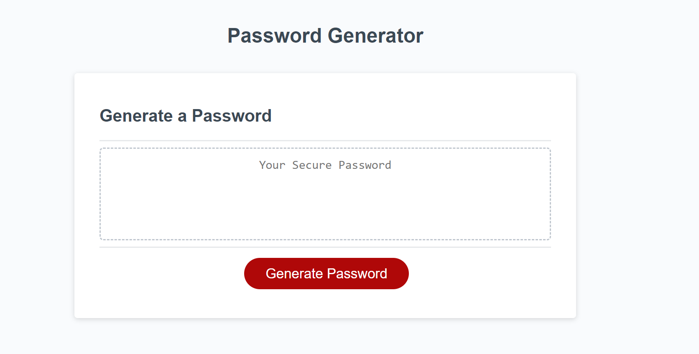
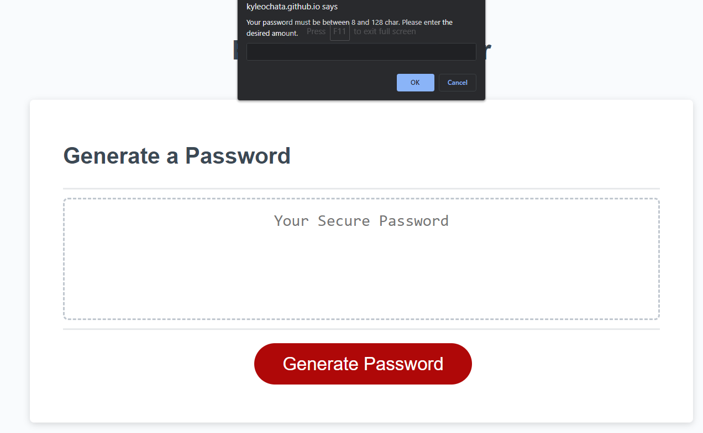
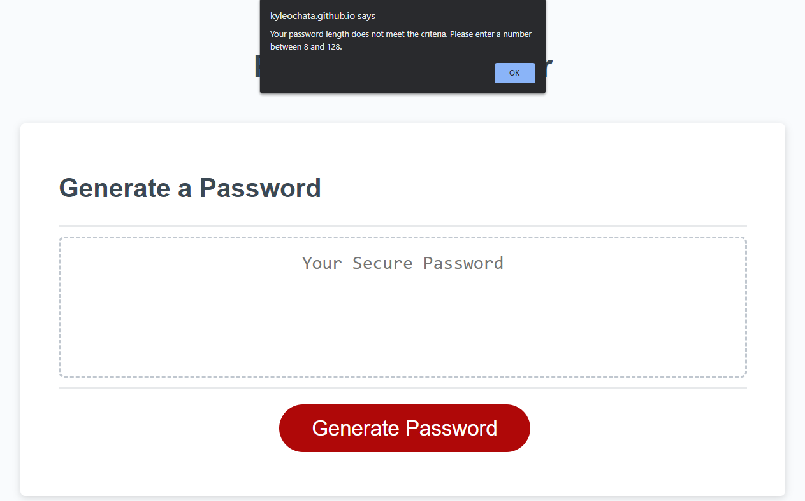
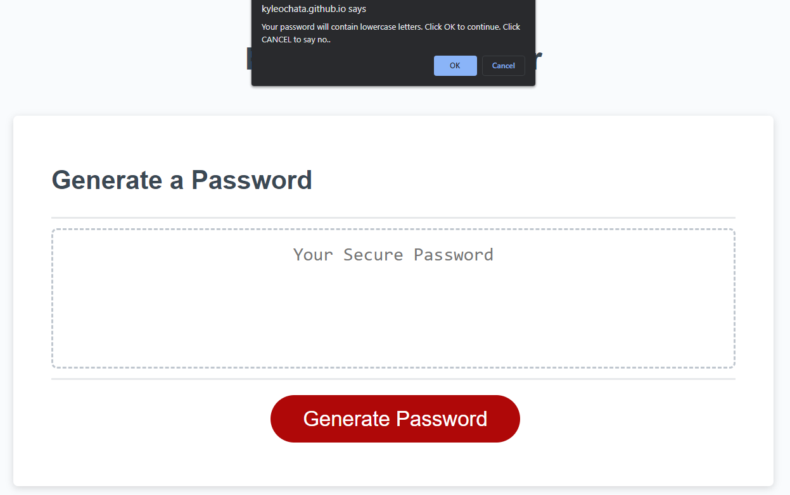
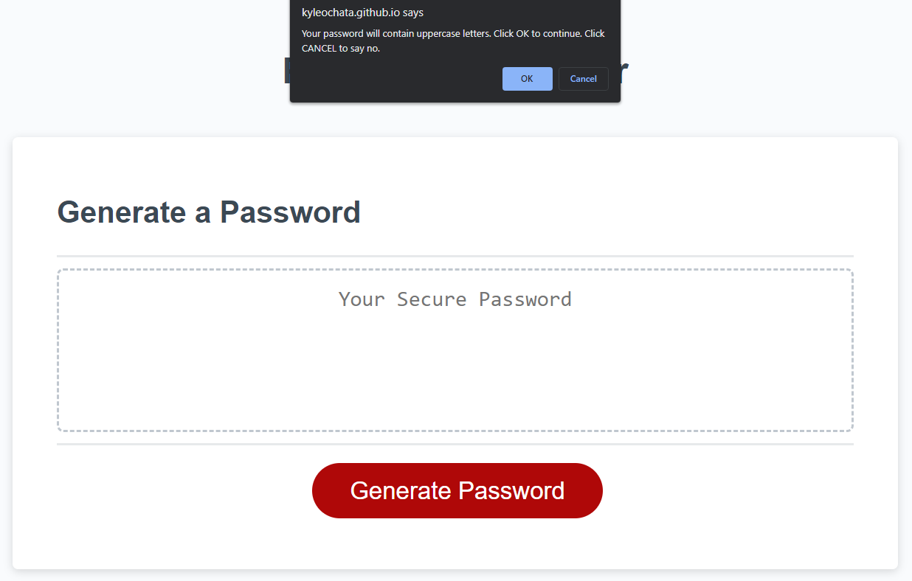
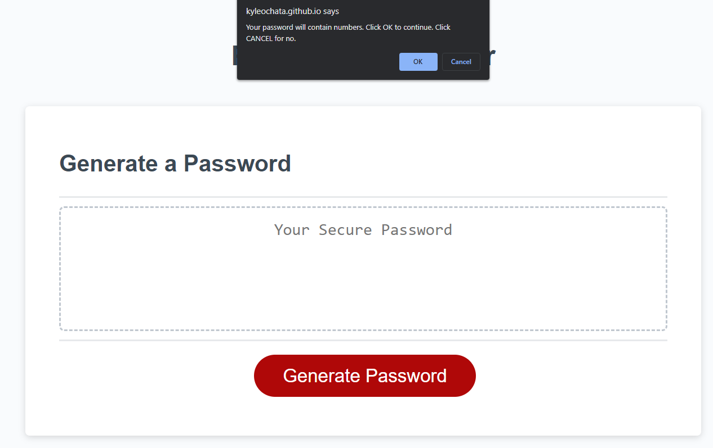
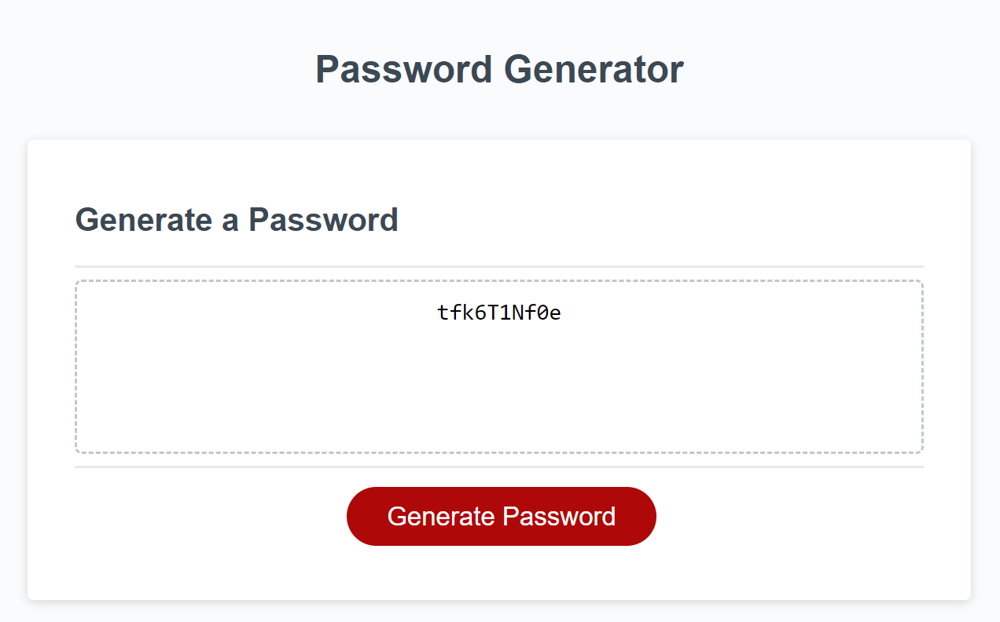

# 03-JavaScript-Challenge-3

## Description

In this project, I aimed to create a random password generator. In today's age, people are required to have many unique passwords to ensure that if one website has a data breach, the rest of their accounts should be safe due to using different passwords. It can be a struggle to come up with unique passwords on the spot and this project aims to make it easy for the user. We were given starter code for HTML, CSS, and JavaScript to get ourselves started. The initial site looked like  the first screenshot provided, with no functioning script when you clicked the button. The second screenshot is of the starter JavaScript code that I had to make functional. After writing the code necessary, the overall look of the site stayed the same, but when you click the button, the script will lead the user through various input criteria for parameters to create the password. Once the parameters are set and the password is generated, the generated password will display in the textarea above the button. The refactored site can be found [here](https://kyleochata.github.io/03-JavaScript-Challenge-3/).

Deployed application with just the starter code: 

Screenshots with prompts and confirms after clicking the button: 

Character length prompt:

Character length alert:

Lowercase confirm:

Uppercase confirm:

Number confirm:

Special Character confirm:

Password Generated: 

## Installation

Locate a suitable place where you would like to download this repository. Once found, copy the repositories SSH or HTTPS to clone through the terminal or download the zipfile from GitHub. After it is downloaded, right-click the index file and launch with your preferred internet browser. 

While in the browser, feel free to examine the HTML and CSS code in developer mode by hitting F12.

## Usage

This repository is allowed for use in a learning environment to evaluate and analyze. 

## Credits

Credits are given to the following:

* UCI full-stack coding bootcamp for the acceptance criteria for the project and the starter code to refactor.
